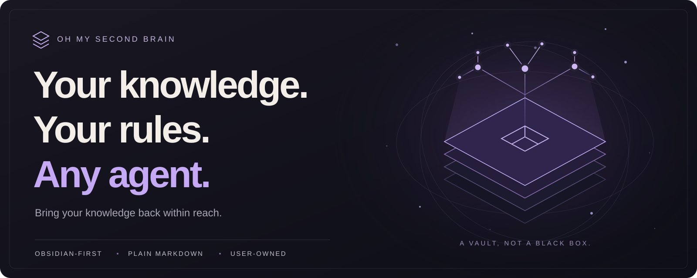

<p align="center">
  
</p>

<h1 align="center">Oh My Second Brain</h1>

<p align="center">
  <strong>A constellation of knowledge, still yours.</strong><br />
  A user-owned knowledge and convention layer for Obsidian, Markdown, and AI agents.
</p>

<p align="center">
  <a href="https://www.npmjs.com/package/oh-my-second-brain"></a>
  <a href="https://nodejs.org/"></a>
  <a href="#mcp-tools--integrations"></a>
  <a href="https://github.com/GoBeromsu/oh-my-second-brain/blob/main/package.json"></a>
</p>

<p align="center">
  <a href="#quick-start"><strong>Quick start</strong></a> ·
  <a href="#how-it-works">How it works</a> ·
  <a href="#documentation">Documentation</a> ·
  <a href="https://github.com/GoBeromsu/oh-my-second-brain/releases">Releases</a> ·
  <a href="https://github.com/GoBeromsu/oh-my-second-brain/blob/main/README.ko.md">한국어</a>
</p>

---

Your vault already holds ideas, decisions, and things you learned. **OMS helps your agents find that knowledge and write within the conventions you defined.** No new note format. No prescribed folder system. No handover of your knowledge to a single host.

Obsidian stays the command center. Your notes stay plain Markdown, readable and editable even when OMS is not running. Connect Claude Code, Codex, or Hermes to the same vault through their host integrations.

## Why OMS?

<table>
<tr>
<td width="50%" valign="top">
<h3>Recall what you already know</h3>
Search your existing notes with lexical retrieval. Choose vector, HyDE, query expansion, or reranking explicitly when you need them.
</td>
<td width="50%" valign="top">
<h3>Your vault, your vocabulary</h3>
Define the meaning of folders, properties, and templates. OMS records your conventions instead of shipping a system you have to adopt.
</td>
</tr>
<tr>
<td width="50%" valign="top">
<h3>Give agents a shared contract</h3>
Seal your vault conventions through setup. Supported write paths check the whole note against that contract before saving it.
</td>
<td width="50%" valign="top">
<h3>Keep the files you own</h3>
Keep using your Markdown notes and templates. Setup does not rewrite them, and the sealed contract lives outside the vault.
</td>
</tr>
<tr>
<td width="50%" valign="top">
<h3>Connect across hosts</h3>
Use native integrations for Claude Code, Codex, and Hermes, with five MCP tools and seven shared workflow skills.
</td>
<td width="50%" valign="top">
<h3>Inspect, don't guess</h3>
Check contract state, audit notes, inspect indexes, and review wikilink suggestions. Search and status stay read-only.
</td>
</tr>
</table>

## Quick start

**Requires Node.js 20 or later and an existing Obsidian or Markdown vault.** Replace `/path/to/vault` with your vault's absolute path.

### 1. Install

```bash
npm install -g oh-my-second-brain
oms --help
```

### 2. Define your vault's conventions

Run setup in your terminal. The interview covers folders, properties, and templates, then seals the contract. Existing notes are not modified.

```bash
oms setup --vault /path/to/vault
oms contract status --vault /path/to/vault
```

### 3. Connect your agent

Install the integration for the host you use:

```bash
oms host install --runtime claude --vault /path/to/vault --yes
```

Replace `claude` with `codex` or `hermes`; use `all` to install all three. Host integration is optional if you only need the CLI. See the [installation guide](./docs/install.md) for Hermes profiles, model setup, and removal.

### 4. Put your knowledge to work

```bash
# Build the derived search index explicitly.
oms index sync --vault /path/to/vault

# Start with lexical search. No vector model required.
oms search query "project decisions" --vault /path/to/vault
```

**Try asking your connected agent:**

> Find my notes about this project and surface the decisions I have already made.

> Check this note against my vault contract and show me what needs attention.

> Suggest related notes I could link to, without changing any files.

These are example requests, not captured run results. Available workflows and write enforcement differ by host as described below.

## How it works

**You define the meaning. Your agent writes the content. OMS checks the structure.**

| Layer | What belongs there |
| :--- | :--- |
| **Your vault** | Your Markdown notes, folders, properties, and original templates. Obsidian remains the command center. |
| **Your contract** | The conventions confirmed through `oms setup`, sealed outside the vault under `~/.oms/vaults/<vault-id>/`. |
| **OMS** | Retrieval, contract judgment on supported writes, link inspection, and explicit index maintenance. |
| **Your agent** | Reads context, composes notes, and uses the appropriate host workflow. You and the agent decide what is worth keeping. |

> [!IMPORTANT]
> **Set up the contract before relying on write checks.** A vault with no seal on this machine is not contract-judged; general path and input safeguards still apply. A contract violation leaves the file unchanged. An allowed write means structural compliance, not factual accuracy or quality approval.

<details>
<summary><strong>The vault contract, in detail</strong></summary>

- **Meaning is user-owned.** The interview covers folders, the property pool, and templates together. OMS hardcodes no property names, folders, or personas and has no Inbox fallback.
- **One control file inside the vault.** `.oms/settings.json` holds `version`, `vaultId`, `templateFolder`, `embedding`, and `agentRepair`. Other `.oms/` entries are ignored and reported as unexpected control files by `oms contract doctor`. `.obsidian/types.json` is a read-only observation, not an override of the seal.
- **Templates stay yours.** OMS records what each template declares. It never rewrites, copies, or applies the template, and does not parse or execute Templater, JavaScript, or a private token language.
- **Drift is visible.** `oms contract status` reports templates as `active`, `drift`, or `missing`. It never silently re-seals a changed template.
- **One judge, bounded feedback.** Denied writes return `{field, kind}` violations and one guidance command, not rule values, store paths, or the contract body.
- **Mismatched seal evidence blocks writes.** When this machine's evidence no longer matches the vault, writes fail with `contract-unreadable` until the owner runs `oms setup` again. A machine with no seal is a different case: its vault is not contract-judged.

See [architecture](./docs/architecture.md), [conventions](./docs/conventions.md), and [ADR-007](https://github.com/GoBeromsu/oh-my-second-brain/blob/main/docs/decisions/ADR-007-vault-contract-ontology.md).

</details>

<details>
<summary><strong>Setup, template interpretation, and recovery</strong></summary>

`oms setup` is an alias of `oms contract setup`. Its interactive interview requires a terminal and refuses to run under `OMS_NON_INTERACTIVE=1`.

The `setup` skill asks the owner each question via `oms setup --questions` and submits answers with `oms setup --answers <file|->`. This path can seal a first or stricter contract; a loosening reseal stays with the owner's terminal.

`oms contract extract --template <path>` returns a template source and its computed hash. The agent reads each template and submits its interpretation with `oms setup --interpretations <file>`. The owner confirms that interpretation before it drives the interview.

`oms contract doctor` diagnoses seal problems, stale locks, orphaned generations, unexpected control files, and hook transport failures. Its `--fix` only re-indexes a moved or unindexed vault. Other broken seals are recovered through `oms setup`.

Model lifecycle is separate: `oms model install|select|waive|status`.

</details>

## MCP tools & integrations

**One domain kernel, with host-native integrations.**

`write` · `search` · `link` · `status` · `doctor`

| MCP tool | Purpose |
| :--- | :--- |
| `write` | Judge a whole note against the sealed contract and save an allowed write. |
| `search` | Retrieve notes or structured context without changing the vault. |
| `link` | Suggest or check wikilinks without applying edits. |
| `status` | Inspect health and statistics without mutation. |
| `doctor` | Diagnose the contract, audit notes, and perform explicit index maintenance. |

The seven skills are `distill`, `doctor`, `link`, `search`, `setup`, `status`, and `write`. `distill` and `setup` are tool-less workflows; sealing has no MCP operation. Detail capabilities use `op` values under the five tools.

| Host | Integration | Write checks |
| :--- | :--- | :--- |
| **Claude Code** | Native plugin assets, skills, and MCP | MCP `write` plus `oms hook pre` for native Write, Edit, MultiEdit, and NotebookEdit. |
| **Codex** | Native plugin assets, guidance, and MCP | MCP `write`; no native write hook. |
| **Hermes** | Profile-scoped skills, guidance, and MCP | MCP `write`; no native write hook. |

> [!NOTE]
> Claude's hook rejects a judged contract violation, but allows the write with a warning if the hook itself cannot run. Native file writes in Codex and Hermes do not pass through the OMS judge. This is not a filesystem-wide sandbox.

For Gajae-Code, install the marketplace plugin with `gjc plugin install oms@oms`; it discovers the seven skills at the package-root `skills/` path. See [host assets](./docs/adapters.md) for integration details.

<details>
<summary><strong>Host maintenance and vault targeting</strong></summary>

Host installation stores a signed maintenance pointer at `${XDG_CONFIG_HOME:-~/.config}/oms/vault.json` and stamps `oms serve mcp --vault /path/to/vault` into managed host entries. Only `oms host install|remove|sync|status` use that pointer to maintain integrations.

Runtime target resolution does not read it. Precedence is **explicit target → local vault controls → bridge → `OMS_VAULT` → current directory**. The current-directory fallback is read-only: sealing, note writes, and derived-state repair cannot use it.

`oms package update` updates the package only. Run `oms host sync` separately to synchronize installed host assets. See [verified targets](./docs/verified-target.md).

</details>

## Search your way

**Lexical by default. Additional retrieval channels by choice.** Search includes notes that fail the contract; a missing or damaged contract does not stop retrieval.

| Capability | How to select it | Requirement |
| :--- | :--- | :--- |
| Lexical search | `oms search query <text>` | No vector model required. |
| Vector search | `--vec <text>` | Complete `OMS_EMBEDDING_PROVIDER` / `OMS_EMBEDDING_MODEL` pair. |
| HyDE | `--hyde <text>` | Embedding pair plus `OMS_GENERATE_PROVIDER` / `OMS_GENERATE_MODEL`. |
| Query expansion | `--expand` | Explicit G004 expansion; `--max-queries` accepts 1–32. |
| Reranking | `--rerank` | Complete `OMS_RERANK_PROVIDER` / `OMS_RERANK_MODEL` pair. |

Missing, incomplete, or uninstalled model selections fail loudly rather than silently switching to another capability. These are available retrieval options, not a claim of parity or superiority over another engine.

Use `oms search context` for structured context. Indexing is explicit: `oms index sync`, `oms index embed`, and `oms index repair` are distinct modes. See [the CLI map](./docs/cli-map.md) for all operations.

## CLI reference

`oms` is the short alias of `oh-my-second-brain`, with fourteen CLI families. Use `oms search query` for note queries and `oms search context` for structured context.

```text
oms setup                                 Interview the vault and seal its contract
oms contract setup|extract|status|doctor   Seal, inspect, or diagnose the contract
oms search query|context                  Search notes or retrieve structured context
oms note audit|get                        Audit existing notes or read them
oms link suggest|check                    Suggest or check wikilinks
oms index sync|embed|repair|status|clean    Manage derived search state
oms graph build|status                    Build or inspect the note graph
oms bridge add|remove|status               Manage repository-to-vault bridges
oms host install|remove|sync|status        Manage host assets and MCP registrations
oms model install|select|waive|status      Manage local model selection
oms package check|update                  Check or update the OMS package
oms serve mcp|http                        Start the MCP or local HTTP server
oms hook pre                              Judge a Claude write against the contract
oms status                                Show read-only aggregate status
```

<details>
<summary><strong>Command behavior and retired operations</strong></summary>

Every recognized command accepts `--help` and `-h`, exits 0, and has no side effects. An unknown command combined with `--help` exits 1.

`oms note audit` reports `{path, field, kind}` entries without rewriting notes. Notes are written as whole content through MCP `write {path, content, template?}`; `template` optionally names the sealed template being followed. There is no completion call or reviewer conversation.

`oms index status --view status|collections|contexts` offers three read-only views. `oms index clean` removes eligible derived state.

Note `create`, `append`, `update`, and `backfill` are retired operations. There is no `link apply`, note renderer, or compatibility path for those retired operations.

</details>

## Documentation

| Start here | Go deeper |
| :--- | :--- |
| [Installation](./docs/install.md): install, setup, models, removal | [Architecture](./docs/architecture.md): authority and domain boundaries |
| [Vault conventions](./docs/conventions.md): settings and sealed contracts | [CLI map](./docs/cli-map.md): command and MCP operation mapping |
| [Host integrations](./docs/adapters.md): Claude Code, Codex, Hermes | [Verified targets](./docs/verified-target.md): safe vault resolution |
| [Releases](https://github.com/GoBeromsu/oh-my-second-brain/releases): published versions | [Changelog](./CHANGELOG.md): what changed and why |

## Contributing & credits

Contributions are welcome. Start with the [contributing guide](https://github.com/GoBeromsu/oh-my-second-brain/blob/main/CONTRIBUTING.md), or [open an issue](https://github.com/GoBeromsu/oh-my-second-brain/issues) with a reproducible problem or a focused proposal.

[ACKNOWLEDGMENTS](./ACKNOWLEDGMENTS.md) records design influences, including Ouroboros and Gajae Code's deep-interview. Those credits describe ideas, not a copied runtime or a research result. The original constellation illustration is inspired by the connected-note landscape at [beomsukoh.com](https://beomsukoh.com/). Illustrations explain concepts; they are not product screenshots, host-smoke evidence, or product-gate results.

---

<p align="center">
  <strong>Your notes stay yours.</strong><br />
  Built by <a href="https://github.com/GoBeromsu">Beomsu Koh</a> · Package licensed MIT
</p>
